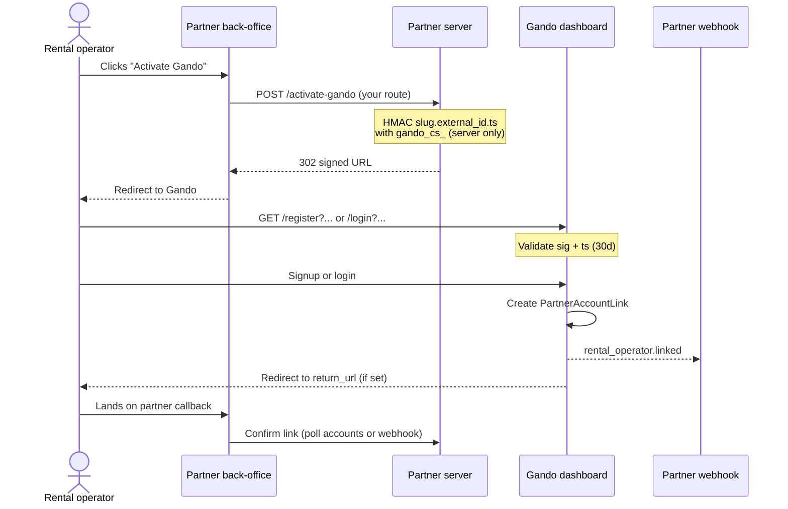

# Link a rental operator (Partner Connect)

Send a rental operator from your back-office to Gando with a signed URL so they can sign up or log in and link their account to your partner. This recipe covers URL signing, security rules, and post-link verification.

**Time:** ~15 minutes  
**SDK:** `Gando\Partner\Connect\UrlBuilder` · **API (verify):** `GET /api/partner/v1/accounts`

> **Integration path** — recommended order for a new partner integration:  
> **1. Connect** _(this recipe)_ → [2. Webhooks](02-webhook-lifecycle.md) → [3. Deposits](03-create-deposit.md)

---

## Prerequisites

1. **Install the SDK**

   ```bash
   composer require gando/partner
   ```

2. **Connect secret** — issued by Gando, prefix `gando_cs_…`. Shown once at partner creation (or on first API key generation). **Not** the same as your partner API key.

3. **Partner slug** — your identifier in connect URLs (e.g. `fleetee`). Provided by Gando.

4. **Partner API key** — `gando_pk_test_…` for staging. Used **only** for Partner API calls after the link exists — never for signing connect URLs.

5. **Server-side backend** — you must sign URLs on your server (BFF, controller, or API route). Never in the browser.

---

## Concept

### Why Partner Connect exists

Before you can create deposits on behalf of a rental operator, Gando needs a **PartnerAccountLink** between your partner record and their Gando account. Partner Connect is the activation path: the rental operator clicks **Activate Gando** in your product, lands on Gando signup or login, and the link is created automatically after authentication.

### Connect secret vs API key

| Credential      | Prefix      | Used for                                                          |
| --------------- | ----------- | ----------------------------------------------------------------- |
| Connect secret  | `gando_cs_` | HMAC signing of `/register` and `/login` URLs only                |
| Partner API key | `gando_pk_` | `x-api-key` on `/api/partner/v1/*` (deposits, accounts, webhooks) |

These are **two different secrets**. Using `gando_pk_` to sign a connect URL always fails validation.

### Signing algorithm

Gando validates the query string server-side when the rental operator opens the URL.

**Payload** (order and separators are mandatory):

```text
{partner_slug}.{external_id}.{ts}
```

**Signature:**

```text
sig = HMAC_SHA256(connect_secret, UTF-8(payload)) → lowercase hex (64 chars)
```

- `partner_slug` — same value as query param `partner`
- `external_id` — your stable rental-operator id in your PMS (same as query param `external_id`)
- `ts` — Unix timestamp in **seconds**. Must match the `ts` query param exactly (string form as sent in the URL)

**Validity window:** 30 days (absolute difference between `ts` and Gando server time). Generate the URL **at click time** on your server — never sign in the browser.

---

## Sequence



---

## Step 1 — Build the signed URL to register your rental operators

You'll need to sign and send the URL to your rental operators so that they can create/login their Gando account and Gando connect it directly to your Gando partner account. 
This is our way to facilitate the integration for your rental operators, they will not have to handle any API keys. 
And also it'll help you to retrieve easilly all Gando deposits created by your rental operators. 

Use `Gando\Partner\Connect\UrlBuilder`. It computes the HMAC and assembles the query string.

```php
use Gando\Partner\Connect\UrlBuilder;

$builder = new UrlBuilder(
    connectSecret: $_ENV['GANDO_CONNECT_SECRET'],
    partnerSlug: 'fleetee',
    baseUrl: 'https://dashboard.gando.app', // staging: same host or value from Gando
);

$signupUrl = $builder->signupUrl(
    externalId: $rentalAccount->id,
    email: $rentalAccount->email,
    name: $rentalAccount->company,
    returnUrl: 'https://fleetee.app/gando/callback',
);
```

`signupUrl()` targets `{baseUrl}/register` with query params:

| Param         | Required | Description                                             |
| ------------- | -------- | ------------------------------------------------------- |
| `partner`     | yes      | Partner slug                                            |
| `external_id` | yes      | Your rental-operator id                                 |
| `ts`          | yes      | Unix seconds (defaults to `time()`)                     |
| `sig`         | yes      | HMAC-SHA256 hex of `{slug}.{external_id}.{ts}`          |
| `email`       | no       | Pre-fill signup email                                   |
| `name`        | no       | Pre-fill company / display name                         |
| `return_url`  | no       | HTTPS callback after connect (localhost allowed in dev) |

Snippet: [`recipes/snippets/connect.signup-url.php`](snippets/connect.signup-url.php)

---

## Step 2 — Redirect your rental operators at click time

Expose a **server route** your frontend calls when the rental operator clicks the button. That route builds a fresh URL and redirects.

```php
// Your controller / route handler — NEVER expose gando_cs_ to the client

$builder = new UrlBuilder(
    connectSecret: $_ENV['GANDO_CONNECT_SECRET'],
    partnerSlug: $_ENV['GANDO_PARTNER_SLUG'],
    baseUrl: $_ENV['GANDO_DASHBOARD_BASE_URL'] ?? 'https://dashboard.gando.app',
);

$signupUrl = $builder->signupUrl(
    externalId: (string) $rentalAccount->id,
    email: $rentalAccount->email,
    name: $rentalAccount->company,
    returnUrl: 'https://fleetee.app/gando/callback',
);

header('Location: '.$signupUrl);
exit;
```

**Frontend pattern (correct):**

```html
<a href="/your-backend/activate-gando?account_id=42">Activate Gando</a>
```

Your backend loads the rental account, signs, and redirects. The browser never sees `gando_cs_`.

---

## Step 2 bis — Existing Gando account (`/login`)

`signupUrl()` returns a `/register?…` URL. For rental operators who **already have a Gando account**, use the **same signed query string** on `/login`:

```php
$connectUrl = $builder->signupUrl(
    externalId: (string) $rentalAccount->id,
    email: $rentalAccount->email,
    returnUrl: 'https://fleetee.app/gando/callback',
);

$loginUrl = str_replace('/register?', '/login?', $connectUrl);

header('Location: '.$loginUrl);
exit;
```

Gando reuses the same signature validation and 30-day window. After login, the `PartnerAccountLink` is created the same way as after signup.

On the register page, Gando also offers a "Already have an account?" link that preserves all connect params on `/login`.

---

## Security

### The connect secret never leaves your server

| Do                                                | Don't                                                         |
| ------------------------------------------------- | ------------------------------------------------------------- |
| Store `gando_cs_` in server env / secrets manager | Put it in `.env` shipped to the frontend build                |
| Sign URLs in PHP on your backend                  | Compute HMAC in JavaScript "for convenience"                  |
| Return a **302 redirect** to the signed Gando URL | Return the secret or a pre-signed URL template to the browser |
| Log errors without the secret                     | Log full query strings containing valid `sig` in production   |

Signing in the browser exposes `gando_cs_` to anyone who opens DevTools — they can then forge links for any `external_id` and link arbitrary accounts to your partner.

### Regenerate on every click

A URL signed on 1 Jan expires after **30 days** (31 Jan). Still generate a fresh URL when the rental operator clicks **Activate Gando** — do not expose `gando_cs_` to the client or pre-sign URLs in frontend code.

Avoid reusing URLs older than 30 days:

- Do not rely on bookmarked connect links indefinitely
- Regenerate if the rental operator returns after the 30-day window

### `ts` must be a string match

The HMAC payload uses the exact `ts` string sent in the query. `UrlBuilder` uses `(string) time()` — do not mix integer arithmetic that changes the string representation (e.g. signing with `1700000000` but sending `ts=1700000000.0`).

---

## Step 3 — Confirm the link

After the rental operator completes signup or login, Gando creates the link and fires `rental_operator.linked` on your webhook endpoint (see [Recipe 02 — Receive webhooks](02-webhook-lifecycle.md)).

### Option A — Webhook (recommended)

Subscribe to `rental_operator.linked` (see [Recipe 02 — Receive webhooks](02-webhook-lifecycle.md)). Example payload:

```json
{
  "event": "rental_operator.linked",
  "createdAt": "2026-05-20T10:00:00.000Z",
  "data": {
    "partnerId": "partner_abc",
    "accountId": "acct_xyz789",
    "externalId": "fleet_acct_42",
    "linkedAt": "2026-05-20T10:00:00.000Z"
  }
}
```

Store `data.accountId` on your rental-operator record — you need it for `POST /api/partner/v1/deposits`.

### Option B — Poll linked accounts

```php
use Gando\Partner\Api\Client;

$api = new Client(apiKey: $_ENV['GANDO_API_KEY']);

$response = $api->accounts->list();
foreach ($response->object->data as $account) {
    if ($account->externalId === (string) $rentalAccount->id) {
        // Linked — store $account->accountId for deposit creation
        $gandoAccountId = $account->accountId;
        break;
    }
}
```

Equivalent: `GET /api/partner/v1/accounts`. Each item includes `accountId`, `externalId`, `status`, and `linkedAt`.

Snippet: [`recipes/snippets/accounts.list.php`](snippets/accounts.list.php)

Once linked, proceed to [Recipe 03 — Create a deposit](03-create-deposit.md) using that `accountId`.

---

## Common errors

Gando surfaces these when the rental operator opens an invalid connect URL (register/login page) or when link creation fails after auth.

| Error                    | Cause                                                                                                         | Fix                                                                       |
| ------------------------ | ------------------------------------------------------------------------------------------------------------- | ------------------------------------------------------------------------- |
| `invalid_signature`      | Wrong `gando_cs_`, wrong payload order, `sig` not lowercase hex, or `ts` in payload does not match query `ts` | Use `UrlBuilder`; verify payload is `{slug}.{external_id}.{ts}` with dots |
| `expired`                | `ts` older than 30 days (or too far in the future)                                                            | Regenerate URL with a fresh `ts`                                          |
| `partner_not_found`      | Wrong `partner` slug                                                                                          | Use the slug issued by Gando                                              |
| `missing_connect_secret` | Partner record has no connect secret in Gando                                                                 | Contact Gando support to provision `gando_cs_`                            |
| `account_already_linked` | Rental operator account is already linked to **another** partner                                              | Rental operator must revoke the other link, or use the correct partner    |

**Frequent integration mistakes:**

| Mistake                                                              | Symptom                                     |
| -------------------------------------------------------------------- | ------------------------------------------- |
| Signing with `gando_pk_` instead of `gando_cs_`                      | `invalid_signature`                         |
| Payload `slug.external_id.ts` but query uses different `external_id` | `invalid_signature`                         |
| Reusing a connect URL older than 30 days                             | `expired`                                   |
| HMAC in browser / secret in frontend bundle                          | Security breach — rotate secret immediately |

---

## Full code

Runnable script — identical to [`examples/01-connect-flow.php`](https://github.com/Gando-Solutions/gando-partner-php-examples/blob/main/examples/01-connect-flow.php) in the examples repo.

```bash
composer require gando/partner
cp .env.example .env
# GANDO_CONNECT_SECRET, GANDO_PARTNER_SLUG, GANDO_API_KEY, GANDO_EXTERNAL_ID
php examples/01-connect-flow.php
```

```php
<?php

declare(strict_types=1);

/**
 * Partner Connect — build a signed activation URL and verify link (Partner API).
 *
 * Usage:
 *   php examples/01-connect-flow.php              # print signup URL
 *   php examples/01-connect-flow.php --check    # list linked accounts
 */

require __DIR__.'/_bootstrap.php';

use Gando\Partner\Connect\UrlBuilder;

$checkOnly = in_array('--check', $argv ?? [], true);

$connectSecret = gando_env('GANDO_CONNECT_SECRET');
$partnerSlug = gando_env('GANDO_PARTNER_SLUG');
$externalId = gando_env('GANDO_EXTERNAL_ID');
$dashboardBase = gando_env('GANDO_DASHBOARD_BASE_URL', required: false);
if ($dashboardBase === '') {
    $dashboardBase = 'https://dashboard.gando.app';
}

$builder = new UrlBuilder(
    connectSecret: $connectSecret,
    partnerSlug: $partnerSlug,
    baseUrl: $dashboardBase,
);

if ($checkOnly) {
    $api = gando_client();
    $found = false;

    foreach ($api->accounts->list()->object->data as $account) {
        if ($account->externalId === $externalId) {
            echo "Linked\n";
            echo "  account_id:  {$account->accountId}\n";
            echo "  external_id: {$account->externalId}\n";
            echo "  status:      {$account->status->value}\n";
            $found = true;
            break;
        }
    }

    if (! $found) {
        echo "No linked account for external_id={$externalId}\n";
        echo "Complete signup on Gando using the URL below, then re-run with --check\n";
    }

    exit($found ? 0 : 1);
}

$signupUrl = $builder->signupUrl(
    externalId: $externalId,
    email: 'ops@example.com',
    name: 'Fleetee Ops',
    returnUrl: 'https://partner.example/gando/callback',
);

echo "Signup URL (valid 30 days):\n";
echo $signupUrl."\n\n";

$loginUrl = str_replace('/register?', '/login?', $signupUrl);
echo "Login URL (same signature, existing Gando account):\n";
echo $loginUrl."\n";
```

For a minimal HTTP redirect handler, wrap `signupUrl()` + `header('Location: …')` in your framework router (see Step 2).

---

## Next steps

Continue the integration path:

1. **[Recipe 02 — Receive webhooks](02-webhook-lifecycle.md)** — register your endpoint and subscribe to `rental_operator.linked` (and deposit events) before creating cautions
2. **[Recipe 03 — Create a deposit](03-create-deposit.md)** — use the linked `accountId` to secure your first caution

Reference:

- **[Connect SDK reference](../docs/sdks/connect/README.md)** — `UrlBuilder` parameters
- **[Partner API reference](https://developers.gando.app/partner)** — full OpenAPI docs
