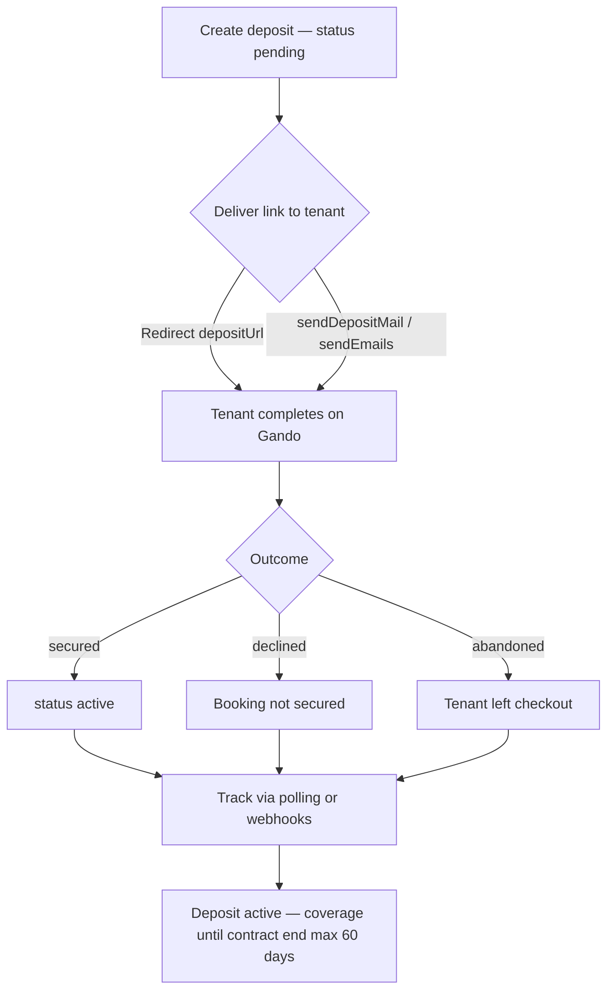

# Create a deposit

Create a deposit on behalf of a linked rental operator, send the tenant to Gando to secure it, and track the outcome. This recipe covers the full partner integration path from API call to an active deposit.

**Time:** ~15 minutes  
**API:** `POST /api/partner/v1/deposits`

---

## Prerequisites

1. **Install the SDK**

```bash
 composer require gando/partner
```

2. **Partner API key** — issued by Gando, prefix `gando_pk_test_…` for staging.
3. **Staging environment** — point requests at `https://stagingv2.gando.app` (production: `https://gando.app`).
4. **Linked rental operator** — you need a `GANDO_ACCOUNT_ID` for an account actively linked to your partner. List linked accounts:

```php
 <?php

 declare(strict_types=1);

 // See recipes/snippets/accounts.list.php
 require 'vendor/autoload.php';

 use Gando\Partner\Api\Client;

 $api = new Client(
     apiKey: getenv('GANDO_API_KEY'),
     baseUrl: getenv('GANDO_BASE_URL') ?: 'https://stagingv2.gando.app',
 );

 // Print each linked rental operator account id
 foreach ($api->accounts->list()->object->data as $acct) {
     echo $acct->accountId, PHP_EOL;
 }
```

5. **Runnable examples repo** (for the full script at the end): [gando-partner-php-examples](https://github.com/Gando-Solutions/gando-partner-php-examples).

---

## Flow



---

## Step 1 (optional) — Initialize the client

If you have not already, instantiate the API client once and reuse it:

```php
use Gando\Partner\Api\Client;

$api = new Client(
    apiKey: getenv('GANDO_API_KEY'),
    baseUrl: 'https://stagingv2.gando.app',
);
```

The SDK sends your key as `x-api-key` on every request.

---

## Step 2 — Create the deposit

Build the request body. Amounts are in **euros** (not cents). `800.0` = €800.00.

```php
use Gando\Partner\Models\Operations\PartnerCreateDepositBody;

$body = new PartnerCreateDepositBody(
    // Rental operator account — must be linked to your partner account (403 otherwise)
    accountId: $accountId,

    // Deposit amount in EUR. Min €70. Default max €2,500 per operator (negotiated ceiling)
    amount: 800.0,

    // Your booking / contract reference for reconciliation in your PMS
    rentalContract: 'CTR-2026-042',

    // Rental period start (ISO 8601 UTC)
    contractStartAt: '2026-04-01T00:00:00.000Z',

    // Rental period end — must be on or after contractStartAt
    contractEndAt: '2026-04-10T23:59:59.000Z',

    // Optional: client id from POST /api/partner/v1/clients on the same account
    clientId: null,

    // When true, response includes depositUrl for immediate tenant redirect
    depositUrlGeneration: true,

    // HTTPS URL Gando redirects to after checkout (required with depositUrlGeneration)
    returnUrl: 'https://partner.example/checkout/complete',
);

$response = $api->deposits->create($body);
$deposit = $response->object->data;
```

**Response (201):**

| Field        | Description                                                  |
| ------------ | ------------------------------------------------------------ |
| `id`         | Deposit id (`dep_…`) — store this on your booking            |
| `reference`  | Human-readable reference (`GAN-…`)                           |
| `status`     | Starts as `pending`                                          |
| `depositUrl` | Tenant checkout URL (only when `depositUrlGeneration: true`) |

**Tip:** Pass an optional `Idempotency-Key` header (UUID v4) on create to safely retry network failures without duplicate deposits. Same key + same body replays the cached response for 24 hours.

---

## Step 3 — Send the link to the customer

Two delivery options. Pick one per booking flow.

### Option A — You deliver the link

Redirect the tenant in your app, or send the link yourself (email, SMS, QR):

```php
// depositUrl is only present when depositUrlGeneration was true
if ($deposit->depositUrl !== null) {
    header('Location: ' . $deposit->depositUrl);
    exit;
}
```

### Option B — Gando sends the email

If you already have the tenant's email and prefer Gando to deliver the link:

```php
use Gando\Partner\Models\Operations\PartnerSendDepositMailBody;

$api->deposits->sendDepositMail(
    id: $deposit->id,
    body: new PartnerSendDepositMailBody(email: 'tenant@example.com'),
);
```

For multiple recipients, use `deposits->sendEmails()` with `PartnerDepositEmailsBody`.

---

## Step 3 bis — Inline redirect in your booking funnel

For combined booking + deposit checkout, create the deposit **before** the final confirmation step and redirect immediately:

1. Set `depositUrlGeneration: true` and a `returnUrl` on your booking completion page.
2. After create, redirect the browser to `depositUrl`.
3. When the tenant finishes on Gando, they land on `returnUrl` with query params:

   | Param | Values |
   | --- | --- |
   | `depositId` | `dep_…` |
   | `depositStatus` | `secured`, `declined`, or `abandoned` |

   Example return URL:

   ```
   https://partner.example/checkout/complete?depositId=dep_abc123&depositStatus=secured
   ```

4. **Do not trust the query params alone** — they reflect the tenant-facing outcome. Always confirm the authoritative API status via polling or webhooks (Step 4).

Handle the return URL in your controller:

```php
$depositId = $_GET['depositId'] ?? null;
$outcome = $_GET['depositStatus'] ?? null;

match ($outcome) {
    'secured'   => /* confirm booking, show success */,
    'declined'  => /* release hold, notify ops */,
    'abandoned' => /* release hold, offer retry */,
    default     => /* verify with GET deposit */,
};
```

---

## Step 4 — Track the deposit status

The deposit moves through statuses as the tenant completes checkout. You need a reliable way to know when it reaches `active`.

### Option A — Polling (`deposits.retrieve`)

Suitable for prototypes or low volume. Poll until a terminal or active state is reached.

```php
function waitForDeposit(Client $api, string $depositId, int $maxAttempts = 30): ?object
{
    $intervals = [2, 3, 5, 5, 10]; // seconds between attempts

    for ($i = 0; $i < $maxAttempts; $i++) {
        $deposit = $api->deposits->retrieve($depositId)->object->data;
        $status = $deposit->status->value;

        if (in_array($status, ['active', 'cancelled', 'payment_issue', 'close'], true)) {
            return $deposit;
        }

        sleep($intervals[min($i, count($intervals) - 1)]);
    }

    return null; // timeout — check again later or rely on webhooks
}
```

**Recommended intervals:**

| Phase        | Interval      | Rationale                                   |
| ------------ | ------------- | ------------------------------------------- |
| First 30 s   | every 2–3 s   | Tenant is likely still on Gando checkout    |
| 30 s – 2 min | every 5 s     | Scoring + 3DS can take time                 |
| After 2 min  | every 10–30 s | Back off; switch to webhooks for production |

Stop polling once status is `active`, `cancelled`, `payment_issue`, or `close`.

### Option B — Webhooks (recommended)

Register an HTTPS endpoint and subscribe to deposit events. Gando pushes status changes in real time — no polling loops, no missed transitions.

Subscribe to at minimum:

- `deposit.status_changed` — wildcard for every transition
- `deposit.activated` — deposit became `active`

See **[Recipe 02 — Receive webhooks](02-webhook-lifecycle.md)** for endpoint setup, HMAC verification, and event handling.

Snippet: `[recipes/snippets/webhooks.create.php](snippets/webhooks.create.php)`

---

## Step 5 — Handle the active deposit

When status is `active`, the deposit is secured. The tenant's funds are not blocked; Gando holds a collection guarantee for the rental operator.

**What to do:**

1. **Mark the booking as deposit-secured** in your PMS — link `deposit.id` to your booking record.
2. **Store** `reference` (`GAN-…`) for support and reconciliation.
3. **Respect the securing window** — coverage lasts until `expiresAt` on the deposit (derived from `contractEndAt`, default max **60 days** from activation). After expiry the deposit moves to `close`.
4. **On damage during the rental** — the rental operator triggers a capture (encaissement) via dashboard or `POST /api/partner/v1/deposits/{id}/capture`. That is outside this recipe.

**Status reference:**

| Status          | Meaning                            |
| --------------- | ---------------------------------- |
| `pending`       | Created, awaiting tenant checkout  |
| `incomplete`    | Tenant started but did not finish  |
| `active`        | Secured — deposit covers the lease |
| `cancelled`     | Voided before or during checkout   |
| `payment_issue` | Fee payment failed                 |
| `close`         | Natural end of contract / expiry   |
| `captured`      | Amount collected on claim          |

---

## Common errors

All errors return the same envelope: `{ "error": { "code", "message", "requestId" } }`.

### 400 — Bad request

| Cause                                                   | Fix                                                                                |
| ------------------------------------------------------- | ---------------------------------------------------------------------------------- |
| Missing or invalid field (`accountId`, `amount`, dates) | Validate body against the schema; all required fields must be present              |
| `amount` below €70 or above operator max                | Use 70–2500 EUR (default ceiling); check error message for resolved limit          |
| `contractEndAt` before `contractStartAt`                | Ensure end ≥ start                                                                 |
| `returnUrl` uses `http://` (non-localhost)              | Use HTTPS, or `http://localhost` for local dev                                     |
| Invalid `clientId`                                      | Create the client first via `POST /api/partner/v1/clients` on the same `accountId` |

### 401 — Authentication failed

| `error.code`      | Cause                                    | Fix                                                        |
| ----------------- | ---------------------------------------- | ---------------------------------------------------------- |
| `missing_api_key` | No `x-api-key` or `Authorization` header | Pass `gando_pk_…` in every request                         |
| `invalid_api_key` | Wrong or unknown key                     | Copy the key from Gando dashboard; use test key on staging |
| `api_key_revoked` | Key was revoked                          | Generate a new partner API key                             |

### 403 — Forbidden

| `error.code`            | Cause                                     | Fix                                                                                                |
| ----------------------- | ----------------------------------------- | -------------------------------------------------------------------------------------------------- |
| `account_not_linked`    | `accountId` is not linked to your partner | Complete partner connect for that rental operator, or pick a linked account from `accounts.list()` |
| `account_revoked`       | Link was revoked                          | Re-link the rental operator via connect                                                            |
| `deposit_access_denied` | Deposit belongs to another partner        | Use the correct `accountId` and partner key                                                        |

Log `requestId` from every error when contacting Gando support.

---

## Full code

Runnable end-to-end script — identical to `[examples/01-create-deposit.php](https://github.com/Gando-Solutions/gando-partner-php-examples/blob/main/examples/01-create-deposit.php)` in the examples repo.

```bash
git clone https://github.com/Gando-Solutions/gando-partner-php-examples.git
cd gando-partner-php-examples
composer install
cp .env.example .env
# Set GANDO_API_KEY, GANDO_ACCOUNT_ID
php examples/01-create-deposit.php
```

```php
<?php

declare(strict_types=1);

/**
 * Create a deposit for a linked rental operator (Partner API).
 *
 * Usage: php examples/01-create-deposit.php
 */

require __DIR__.'/_bootstrap.php';

use Gando\Partner\Models\Operations\PartnerCreateDepositBody;

$accountId = gando_env('GANDO_ACCOUNT_ID');
$api = gando_client();

$body = new PartnerCreateDepositBody(
    accountId: $accountId,
    amount: 800.0,
    rentalContract: 'CTR-'.date('Y').'-'.random_int(100, 999),
    contractStartAt: gmdate('Y-m-d\TH:i:s.000\Z'),
    contractEndAt: gmdate('Y-m-d\TH:i:s.000\Z', strtotime('+7 days')),
    clientId: null,
    depositUrlGeneration: true,
    returnUrl: 'https://partner.example/checkout/complete',
);

try {
    $response = $api->deposits->create($body);
    $deposit = $response->object->data;

    echo "Deposit created\n";
    echo "  id:          {$deposit->id}\n";
    echo "  reference:   {$deposit->reference}\n";
    echo "  status:      {$deposit->status->value}\n";
    if ($deposit->depositUrl !== null && $deposit->depositUrl !== '') {
        echo "  deposit_url: {$deposit->depositUrl}\n";
    }
} catch (Throwable $e) {
    gando_print_api_error($e);
    exit(1);
}
```

---

## Next steps

- **[Recipe 02 — Receive webhooks](02-webhook-lifecycle.md)** — production-grade status tracking
- **[Create a client](snippets/clients.create.php)** — pre-fill tenant info before creating the deposit
- **[Partner API reference](https://developers.gando.app/partner)** — full endpoint documentation
