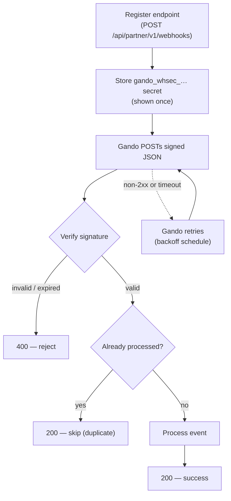

# Receive webhooks

Register an HTTPS endpoint, verify every inbound delivery, and react to deposit and connect events in real time. This recipe covers setup, two production receiver implementations (plain PHP and Symfony), idempotency, and local testing.

**Time:** ~20 minutes  
**API:** `POST /api/partner/v1/webhooks` (register) · `POST` your endpoint (receive)

---

## Prerequisites

1. **Install the SDK**

```bash
 composer require gando/partner
```

1. **Partner API key** — `gando_pk_test_…` for staging.
2. **Staging environment** — `https://stagingv2.gando.app` (production: `https://gando.app`).
3. **Public HTTPS URL** for your receiver — use [ngrok](https://ngrok.com/) or similar for local dev (see [Test locally](#test-locally)).
4. **Runnable examples repo** (optional): [gando-partner-php-examples](https://github.com/Gando-Solutions/gando-partner-php-examples) — `examples/02-webhook-receiver-plain.php` and `examples/02-webhook-receiver-symfony/`.

---

## Overview

Gando sends **JSON POST** requests to your endpoint when something changes on a linked rental operator or deposit. Each delivery is signed with HMAC-SHA256. Your server must verify the signature on the **raw request body** before parsing JSON.

### Event types

Authoritative list: `[types/partner-webhook.ts](https://github.com/Gando-Solutions/gando-app/blob/main/types/partner-webhook.ts)` (`PARTNER_WEBHOOK_EVENTS` / `lib/partners/partner-webhook.zod.ts`).

| Event                    | When it fires                                                                           |
| ------------------------ | --------------------------------------------------------------------------------------- |
| `rental_operator.linked` | A rental operator completes partner connect and is linked to your partner               |
| `deposit.status_changed` | Wildcard — any deposit status transition (fallback when no more specific event matches) |
| `deposit.activated`      | Deposit becomes `active` (tenant secured the caution)                                   |
| `deposit.captured`       | Deposit becomes `captured` (collection on claim)                                        |
| `deposit.expired`        | Deposit becomes `close` (natural end of contract / expiry)                              |
| `deposit.cancelled`      | Deposit becomes `cancelled`                                                             |

**Dispatch rule:** if your endpoint is subscribed to both `deposit.status_changed` and a specific event (e.g. `deposit.activated`), Gando sends **one** delivery — the most specific subscribed event wins. You do not receive both for the same transition.

> There is no `deposit.refused` event. A tenant declined by scoring or who abandons checkout is reflected as `deposit.cancelled` or `deposit.status_changed` with `status` `cancelled` / `payment_issue` / `incomplete`.

### Headers on every delivery

| Header              | Description                                        |
| ------------------- | -------------------------------------------------- |
| `Content-Type`      | `application/json`                                 |
| `X-Gando-Signature` | `sha256=<hex>` — HMAC over `<timestamp>.<rawBody>` |
| `X-Gando-Timestamp` | Unix time in **seconds**                           |
| `X-Gando-Event`     | Event name (e.g. `deposit.activated`)              |

### Payload shape (deposit events)

All deposit events share the same JSON structure (`DepositStatusChangedPayload` in `lib/services/webhook-payload.types.ts`):

```json
{
  "event": "deposit.activated",
  "createdAt": "2026-05-20T10:00:00.000Z",
  "data": {
    "id": "dep_abc123",
    "reference": "GAN-001",
    "rentalContract": "CTR-2026-042",
    "status": "active",
    "previousStatus": "pending",
    "amountCents": 80000,
    "contractStartAt": "2026-04-01T00:00:00.000Z",
    "contractEndAt": "2026-04-10T23:59:59.000Z",
    "client": {
      "id": "cli_xyz",
      "email": "tenant@example.com",
      "firstName": "Jean",
      "lastName": "Dupont"
    },
    "partnerContext": {
      "partnerId": "partner_abc",
      "partnerName": "CityRent",
      "externalId": "EXT-001"
    }
  }
}
```

`partnerContext` is present only when the deposit was created via the Partner API. `client` may be `null`.

### Flow



---

## Step 1 — Register your endpoint

Create a webhook subscription with your public URL. The signing secret is returned **exactly once** — store it immediately.

```php
use Gando\Partner\Api\Client;
use Gando\Partner\Models\Operations\CreatePartnerWebhookSubscriptionBody;
use Gando\Partner\Models\Operations\WebhooksCreateEventRequest;

$api = new Client(
    apiKey: getenv('GANDO_API_KEY'),
    baseUrl: 'https://staging.gando.app',
);

$body = new CreatePartnerWebhookSubscriptionBody(
    url: 'https://partner.example.com/webhooks/gando',
    // Optional — omit to subscribe to all events in PARTNER_WEBHOOK_EVENTS
    events: [
        WebhooksCreateEventRequest::DepositStatusChanged,
        WebhooksCreateEventRequest::DepositActivated,
        WebhooksCreateEventRequest::DepositCancelled,
    ],
);

$response = $api->webhooks->create($body);
$webhook = $response->object->data;

// CRITICAL: persist before closing this request handler
$secret = $webhook->secret; // gando_whsec_…
file_put_contents('/secure/path/gando_webhook_secret', $secret, LOCK_EX);
```

Snippet: `[recipes/snippets/webhooks.create.php](snippets/webhooks.create.php)`

**Response (201):**

| Field    | Description                                                    |
| -------- | -------------------------------------------------------------- |
| `id`     | Webhook id (`pwh_…`)                                           |
| `url`    | Your endpoint URL                                              |
| `secret` | Signing secret — **only returned here** and on `rotate-secret` |
| `events` | Subscribed event types                                         |

Store the secret in your secrets manager or `.env` as `GANDO_WEBHOOK_SECRET`. Never commit it to git.

If you lose the secret, call `POST /api/partner/v1/webhooks/{id}/rotate-secret` — the old secret stops working immediately.

---

## Step 2 — Implement your receiver

Gando considers a delivery **successful** when your endpoint returns **2xx within 10 seconds**. Return 2xx only after you have safely recorded the event (or enqueued it). Slow work belongs in a background job.

### Plain PHP (standalone)

Single-file router suitable for `php -S` or any web server that forwards the raw body unchanged.

```bash
# From the examples repo (or copy the script below)
composer install
cp .env.example .env   # set GANDO_WEBHOOK_SECRET=gando_whsec_…

# CLI self-test (signature round-trip)
php examples/02-webhook-receiver-plain.php

# HTTP receiver on port 8787
php -S 127.0.0.1:8787 examples/02-webhook-receiver-plain.php
```

```php
<?php

declare(strict_types=1);

/**
 * Gando partner webhook receiver (plain PHP).
 *
 * CLI:  php examples/02-webhook-receiver-plain.php
 * HTTP: php -S 127.0.0.1:8787 examples/02-webhook-receiver-plain.php
 */

require __DIR__.'/vendor/autoload.php';

use Gando\Partner\Exceptions\WebhookSignatureException;
use Gando\Partner\WebhookVerifier;

if (PHP_SAPI === 'cli') {
    run_cli_self_test();
    exit(0);
}

run_http_receiver();

function run_cli_self_test(): void
{
    $secret = getenv('GANDO_WEBHOOK_SECRET');
    if (! is_string($secret) || $secret === '') {
        fwrite(STDERR, "Set GANDO_WEBHOOK_SECRET\n");
        exit(1);
    }

    $rawBody = json_encode([
        'event' => 'deposit.status_changed',
        'createdAt' => gmdate('Y-m-d\TH:i:s.000\Z'),
        'data' => [
            'id' => 'dep_example',
            'reference' => 'GAN-EXAMPLE',
            'status' => 'active',
            'previousStatus' => 'pending',
        ],
    ], JSON_THROW_ON_ERROR);

    $timestamp = (string) time();
    $signature = 'sha256='.hash_hmac('sha256', $timestamp.'.'.$rawBody, $secret);

    try {
        WebhookVerifier::verify($rawBody, $signature, $timestamp, $secret);
    } catch (WebhookSignatureException $e) {
        fwrite(STDERR, "Verification failed: {$e->getReason()}\n");
        exit(1);
    }

    echo "Webhook signature verification OK\n";
    echo "Start HTTP: php -S 127.0.0.1:8787 examples/02-webhook-receiver-plain.php\n";
}

function run_http_receiver(): void
{
    if ($_SERVER['REQUEST_METHOD'] !== 'POST') {
        http_response_code(405);
        header('Allow: POST');
        echo 'Method Not Allowed';
        exit;
    }

    $secret = $_ENV['GANDO_WEBHOOK_SECRET'] ?? getenv('GANDO_WEBHOOK_SECRET');
    if (! is_string($secret) || $secret === '') {
        http_response_code(500);
        echo 'Missing GANDO_WEBHOOK_SECRET';
        exit;
    }

    // 1. Read raw body BEFORE any json_decode
    $rawBody = file_get_contents('php://input') ?: '';
    $signature = $_SERVER['HTTP_X_GANDO_SIGNATURE'] ?? '';
    $timestamp = $_SERVER['HTTP_X_GANDO_TIMESTAMP'] ?? '';
    $event = $_SERVER['HTTP_X_GANDO_EVENT'] ?? '';

    // 2. Verify signature (default tolerance: 300 s)
    try {
        WebhookVerifier::verify($rawBody, $signature, $timestamp, $secret);
    } catch (WebhookSignatureException) {
        http_response_code(400);
        exit;
    }

    // 3. Idempotency — same bytes on every Gando retry for this delivery
    $eventId = hash('sha256', $rawBody);
    if (webhook_already_processed($eventId)) {
        http_response_code(200);
        header('Content-Type: application/json');
        echo json_encode(['received' => true, 'duplicate' => true]);
        exit;
    }

    // 4. Parse and handle
    $payload = json_decode($rawBody, true, flags: JSON_THROW_ON_ERROR);

    try {
        handle_gando_webhook($event, $payload);
        mark_webhook_processed($eventId);
    } catch (Throwable $e) {
        error_log('[gando-webhook] handler failed: '.$e->getMessage());
        http_response_code(500);
        exit;
    }

    http_response_code(200);
    header('Content-Type: application/json');
    echo json_encode(['received' => true]);
}

function handle_gando_webhook(string $event, array $payload): void
{
    $depositId = $payload['data']['id'] ?? 'unknown';

    match ($event) {
        'deposit.activated' => error_log("[gando] deposit secured: {$depositId}"),
        'deposit.cancelled' => error_log("[gando] deposit cancelled: {$depositId}"),
        'deposit.captured'  => error_log("[gando] deposit captured: {$depositId}"),
        'deposit.expired'   => error_log("[gando] deposit expired: {$depositId}"),
        'rental_operator.linked' => error_log('[gando] rental operator linked'),
        default => error_log("[gando] {$event}: {$depositId}"),
    };
}

function webhook_already_processed(string $eventId): bool
{
    $pdo = webhook_pdo();
    $stmt = $pdo->prepare('SELECT 1 FROM webhook_events_received WHERE event_id = ? LIMIT 1');
    $stmt->execute([$eventId]);

    return (bool) $stmt->fetchColumn();
}

function mark_webhook_processed(string $eventId): void
{
    $pdo = webhook_pdo();
    $stmt = $pdo->prepare(
        'INSERT INTO webhook_events_received (event_id, processed_at) VALUES (?, NOW())'
    );
    $stmt->execute([$eventId]);
}

function webhook_pdo(): PDO
{
    static $pdo = null;
    if ($pdo === null) {
        $pdo = new PDO(getenv('DATABASE_URL') ?: 'sqlite:'.__DIR__.'/webhook_events.sqlite');
        $pdo->exec(<<<'SQL'
            CREATE TABLE IF NOT EXISTS webhook_events_received (
                event_id     TEXT PRIMARY KEY,
                processed_at TIMESTAMP NOT NULL DEFAULT CURRENT_TIMESTAMP
            )
        SQL);
    }

    return $pdo;
}
```

`WebhookVerifier::verify()` implements the same algorithm as Gando's outbound signer: HMAC-SHA256 over `{timestamp}.{rawBody}` with your `gando_whsec_…` key.

---

### Symfony (`gando/partner-symfony`)

For Symfony apps, use the official bundle — it ships a verified controller, optional cache-based deduplication, and typed domain events.

```bash
composer require gando/partner gando/partner-symfony
```

`config/bundles.php`

```php
return [
    // ...
    Gando\Partner\Symfony\GandoPartnerBundle::class => ['all' => true],
];
```

`.env`

```dotenv
GANDO_API_KEY=gando_pk_test_xxx
GANDO_WEBHOOK_SECRET=gando_whsec_xxx
```

`config/packages/gando_partner.php`

```php
<?php

declare(strict_types=1);

use Symfony\Component\DependencyInjection\Loader\Configurator\ContainerConfigurator;

return static function (ContainerConfigurator $container): void {
    $container->extension('gando_partner', [
        'api_key' => (string) ($_ENV['GANDO_API_KEY'] ?? getenv('GANDO_API_KEY')),
        'base_url' => 'https://stagingv2.gando.app',
        'webhooks' => [
            'secret' => (string) ($_ENV['GANDO_WEBHOOK_SECRET'] ?? getenv('GANDO_WEBHOOK_SECRET')),
            'tolerance_seconds' => 300,
            'path' => '/webhooks/gando',
            'dedup_ttl_seconds' => 86400, // requires cache.app
        ],
    ]);
};
```

`config/routes/gando_partner.yaml` (required for MicroKernel apps)

```yaml
gando_partner_webhook:
  path: /webhooks/gando
  controller: gando.partner.webhook_controller
  methods: [POST]
```

`src/EventListener/GandoWebhookListener.php`

```php
<?php

declare(strict_types=1);

namespace App\EventListener;

use Gando\Partner\Symfony\Event\DepositActivated;
use Gando\Partner\Symfony\Event\DepositCancelled;
use Gando\Partner\Symfony\Event\DepositStatusChanged;
use Gando\Partner\Symfony\Event\RentalOperatorLinked;
use Psr\Log\LoggerInterface;
use Symfony\Component\EventDispatcher\Attribute\AsEventListener;

final class GandoWebhookListener
{
    public function __construct(
        private readonly LoggerInterface $logger,
    ) {
    }

    #[AsEventListener]
    public function onDepositActivated(DepositActivated $event): void
    {
        $webhook = $event->webhook;

        $this->logger->info('Deposit secured', [
            'deposit_id' => $webhook->depositId(),
            'rental_contract' => $webhook->rentalContract(),
            'amount_cents' => $webhook->amountCents(),
        ]);

        // Mark booking as deposit-secured in your PMS
    }

    #[AsEventListener]
    public function onDepositStatusChanged(DepositStatusChanged $event): void
    {
        $webhook = $event->webhook;

        $this->logger->info('Deposit status changed', [
            'deposit_id' => $webhook->depositId(),
            'status' => $webhook->depositStatus(),
            'previous_status' => $webhook->previousDepositStatus(),
        ]);
    }

    #[AsEventListener]
    public function onDepositCancelled(DepositCancelled $event): void
    {
        $this->logger->warning('Deposit cancelled', [
            'deposit_id' => $event->webhook->depositId(),
        ]);
    }

    #[AsEventListener]
    public function onRentalOperatorLinked(RentalOperatorLinked $event): void
    {
        $this->logger->info('Rental operator linked', [
            'account_id' => $event->webhook->accountId(),
            'external_id' => $event->webhook->externalId(),
        ]);
    }
}
```

```bash
symfony server:start --port=8788
# Endpoint: POST http://127.0.0.1:8788/webhooks/gando
```

Full runnable app: [examples/02-webhook-receiver-symfony](https://github.com/Gando-Solutions/gando-partner-php-examples/tree/main/examples/02-webhook-receiver-symfony).

> **Laravel** support is deferred to **V1.1** when the first Laravel partner goes live.

---

## Idempotency (partner-side)

Gando retries failed deliveries with **exponential backoff**. The JSON body is identical on every attempt for the same delivery; only `X-Gando-Timestamp` and `X-Gando-Signature` change.

If you process an event twice (e.g. your handler crashes after side effects but before the HTTP response), you may double-book a rental or send duplicate emails. **Store every processed event id before returning 2xx.**

### Recommended deduplication key

Use a stable id derived from the verified raw body:

```php
$eventId = hash('sha256', $rawBody);
```

Gando will ship an `X-Gando-Event-Id` header (`evt_…`) in a future release; when present, prefer that value over the body hash.

### Example table

```sql
CREATE TABLE webhook_events_received (
    event_id     TEXT PRIMARY KEY,
    processed_at TIMESTAMPTZ NOT NULL DEFAULT NOW()
);
```

```php
// After verify(), before business logic:
if ($repo->exists($eventId)) {
    http_response_code(200);
    exit;
}

$db->transaction(function () use ($eventId, $payload) {
    $repo->insert($eventId);
    processDeposit($payload);
});
```

Insert the row **in the same transaction** as your business update, or enqueue to a queue with the `event_id` as the message deduplication key.

---

## Replay a delivery

### Test delivery (available now)

Send a synthetic `deposit.activated` event to validate your endpoint end-to-end:

```php
$api->webhooks->test(id: $webhookId);
```

Equivalent: `POST /api/partner/v1/webhooks/{id}/test`. Your endpoint must be subscribed to `deposit.activated` or `deposit.status_changed`.

### Redeliver a past event (dashboard)

> **Coming soon.** The partner dashboard will let you redeliver a failed delivery from the delivery log without re-triggering the underlying deposit transition.

Until then:

1. List deliveries: `GET /api/partner/v1/webhooks/{id}/deliveries`
2. Fix your receiver and use **test** to confirm verification + handling
3. For missed real events, poll `GET /api/partner/v1/deposits/{id}` as a backfill

---

## Common pitfalls

| Pitfall                                          | Why it breaks                                                         | Fix                                                                                                   |
| ------------------------------------------------ | --------------------------------------------------------------------- | ----------------------------------------------------------------------------------------------------- |
| `json_decode` before `WebhookVerifier::verify()` | Signature is computed over raw bytes; re-encoding changes the payload | Read `php://input` once, verify, then parse                                                           |
| Ignoring timestamp tolerance                     | Stolen payloads can be replayed indefinitely                          | Use default 300 s tolerance; reject expired timestamps (`WebhookSignatureException` reason `expired`) |
| Return **200** then crash in shutdown handler    | Gando marks the delivery delivered; the event is lost                 | Persist or enqueue **before** sending 2xx; use transactions                                           |
| Return **200** on handler errors                 | Same — no retry                                                       | Return **500** so Gando schedules a retry                                                             |
| Middleware consuming the body                    | Empty body → signature mismatch                                       | Disable body parsing middleware on the webhook route                                                  |
| Storing only `X-Gando-Event` without dedup       | Retries reuse the same body                                           | Dedupe on body hash (or future `X-Gando-Event-Id`)                                                    |
| Wrong secret after rotation                      | All verifications fail                                                | Update `GANDO_WEBHOOK_SECRET` when you rotate                                                         |

---

## Test locally

1. **Start your receiver** (plain PHP on `8787` or Symfony on `8788`).
2. **Expose with ngrok:**

```bash
 ngrok http 8787
 # Copy https://abc123.ngrok-free.app
```

1. **Register the ngrok URL** on staging:

```bash
 GANDO_WEBHOOK_URL=https://abc123.ngrok-free.app php recipes/snippets/webhooks.create.php
```

Save the printed `gando_whsec_…` into `.env` as `GANDO_WEBHOOK_SECRET` and restart your receiver.

4. **Send a test delivery:**

```php
 $api->webhooks->test(id: 'pwh_…');
```

1. **Trigger a real event** — complete [Recipe 01 — Create a deposit](01-create-deposit.md) with `depositUrlGeneration: true` and finish tenant checkout on staging. Watch your receiver logs for `deposit.activated`.
2. **Inspect deliveries** in the Gando partner dashboard or via `GET /api/partner/v1/webhooks/{id}/deliveries`.

---

## Next steps

- **[Webhooks SDK reference](../docs/sdks/webhooks/README.md)** — list, update, rotate secret, deliveries
- **[Partner API reference](https://developers.gando.app/partner)** — full OpenAPI docs
