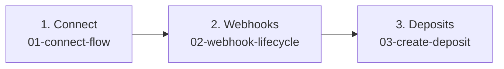

# Partner integration recipes

Step-by-step guides for integrating Gando into rental management software. Follow them **in order** on a first integration.

| Step | Recipe | Time | Outcome |
| --- | --- | --- | --- |
| 1 | **[Link a rental operator](01-connect-flow.md)** | ~15 min | Rental operators activate Gando from your back-office; you receive `accountId` |
| 2 | **[Receive webhooks](02-webhook-lifecycle.md)** | ~20 min | Real-time `rental_operator.linked` and `deposit.*` events with verified signatures |
| 3 | **[Create a deposit](03-create-deposit.md)** | ~15 min | Secure a caution on behalf of a linked operator; tenant completes checkout on Gando |

## Snippets

Quick copy-paste scripts (no narrative):

- [`connect.signup-url.php`](snippets/connect.signup-url.php) — build a signed `/register` URL
- [`webhooks.create.php`](snippets/webhooks.create.php) · [`webhooks.verify.php`](snippets/webhooks.verify.php)
- [`accounts.list.php`](snippets/accounts.list.php) · [`deposits.create.php`](snippets/deposits.create.php) · [`clients.create.php`](snippets/clients.create.php)

## Examples repo

Full runnable scripts: [gando-partner-php-examples](https://github.com/Gando-Solutions/gando-partner-php-examples).
